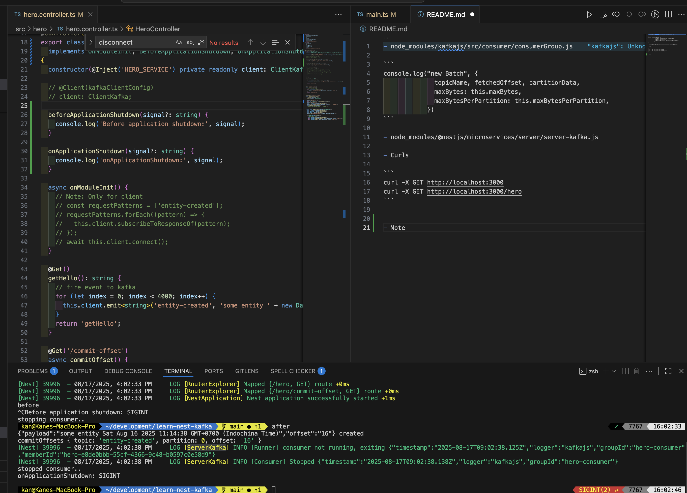
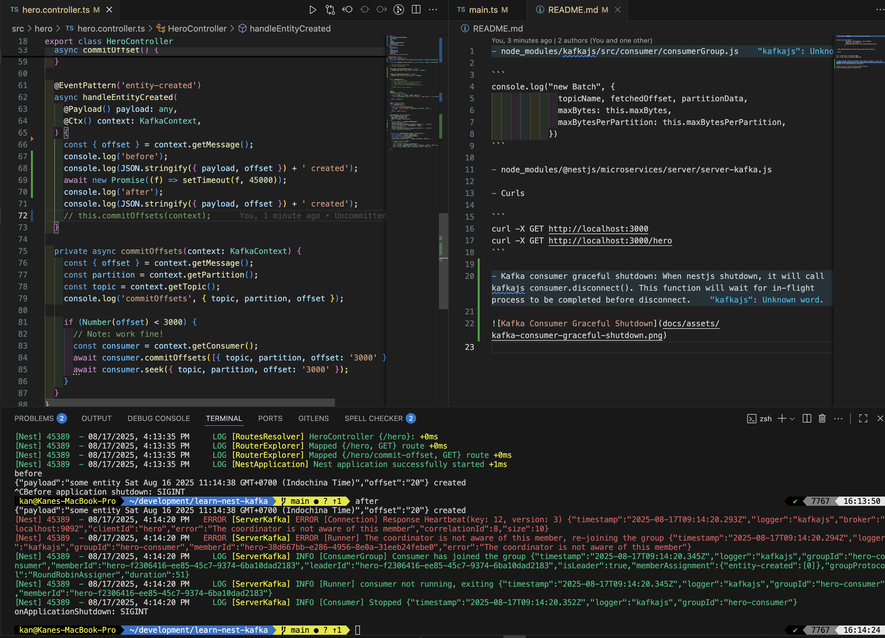

- node_modules/kafkajs/src/consumer/consumerGroup.js

```
console.log("new Batch", {
              topicName, fetchedOffset, partitionData,
              maxBytes: this.maxBytes,
              maxBytesPerPartition: this.maxBytesPerPartition,
            })
```

- node_modules/@nestjs/microservices/server/server-kafka.js

- Curls

```
curl -X GET http://localhost:3000
curl -X GET http://localhost:3000/hero
```

- Kafka consumer graceful shutdown: When nestjs shutdown, it will call kafkajs consumer.disconnect(). This function will wait for in-flight process to be completed before disconnect.



- If the consumer process is take time, we might got the heartbeat error because of reaching the session timeout.


